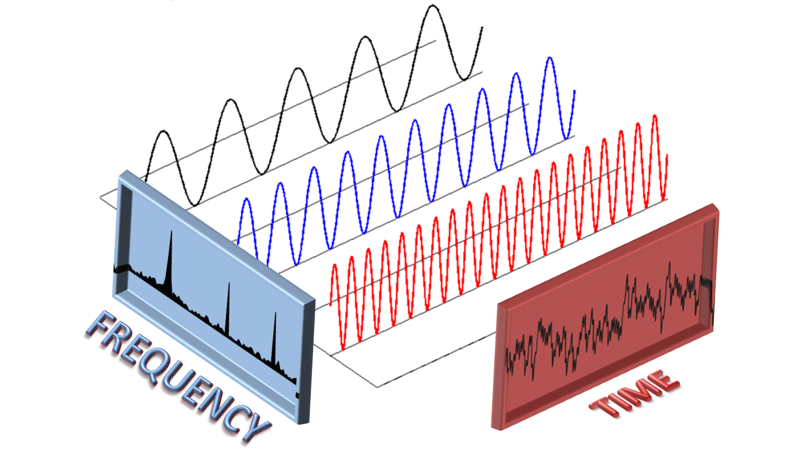
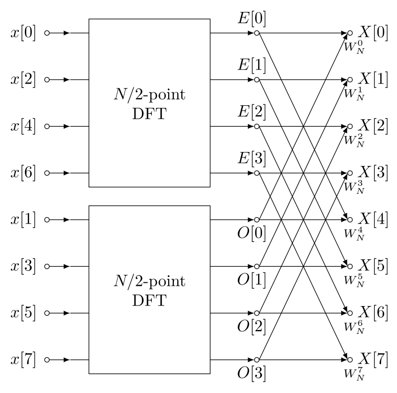

## DFT (discrete fourier transform)


I will explain what discrete fourier transform is in a way i understood 
it and go step by step starting from some imaginary number operations 
and progress towards what the code does. But before you start reading this, i strongly recommend visiting this website: [interactive website](https://www.jezzamon.com/fourier/index.html). 

**It demonstrates what Fourier Transform is and what it does. My explanation focuses on how it works, balancing clarity and detail while avoiding excessive math. The goal is to help visualize the process and understand the mathematics behind it.**
***
This is a complex number with real component x and imaginary component y:  
```math
z=x+iy
```
And this is the same complex number in trigonometric form:  
```math
z=r(\cos(\theta)+i\sin(\theta))
``` 
```math
r=|z|=\sqrt{x^2+y^2}
``` 
So we can imagine complex number in complex plane defined like point (x,y) 
or by angle and distance r from (0,0) to (x,y).
If 2 complex number in trigonometric form are multiplied:
```math
z_1\cdot z_2 = [r_1(\cos(\theta_1)+i\sin(\theta_1)]\cdot [r_2(\cos(\theta_2)+i\sin(\theta_2)]\\
=r_1r_2[\cos(\theta_1+\theta_2)+i\sin(\theta_1+\theta_2)]
```
We can conclude that:
* resulting number is rotated counter clockwise by angle 
equal to sum of initial angles $\theta_1$ and $\theta_2$ 
* distance from origin to resulting complex number is equal to product 
of r1 and r2. 

But if we multiply z1 by this number (known as *twiddle factor*):
```math
\omega_N=\cos(-2\pi /N)+i\sin(-2\pi /N)\\
=\cos(2\pi /N)-i\sin(2\pi /N)
``` 
The resulting imaginary number will be rotated clockwise by 2pi/N radians, 
and distance from origin (vector magnitude) will remain unchanged. So we 
can take any number, real or imaginary, multiply it by *twiddle factor* 
and get a new number wrapped around a circle and rotated by -2pi/N. The 
minus sign is just the convention (it indicates clockwise rotation). 

There's also one more interesting property of this complex number. Multiplying any complex number with our twiddle factor can be imagined 
as vector matrix multiplication. This is the rotation matrix, special type of 
orthogonal matrix used in computer graphics for rotation in 2D or 3D space (3D rotation matrix is 3x3 and slightly different):
```math
R_{\theta} =
\begin{bmatrix}
\cos\theta & -\sin\theta \\
\sin\theta & \cos\theta
\end{bmatrix}
```
Which if we multiply by our complex number z = x + iy as (x,y) vector:
```math
\begin{bmatrix}
x' \\
y'
\end{bmatrix}
=
\begin{bmatrix}
\cos\theta & -\sin\theta \\
\sin\theta & \cos\theta
\end{bmatrix}
\begin{bmatrix}
x \\
y
\end{bmatrix}
=
\begin{bmatrix}
x\cos\theta - y\sin\theta \\
x\sin\theta + y\cos\theta
\end{bmatrix}
```
resulting complex number (x',y') will be our point rotated by angle $\theta$.
We can also make our twiddle factor look more fancy using Euler's formula:
```math
e^{i\theta}=\cos(\theta)+i\sin(\theta)\Rightarrow \omega_N=e^{-2\pi i / N}
```
***
Now let's get to Discrete Fourier Transform formula:

```math
\text{DFT}: X_k = \sum_{n=0}^{N-1} x_n \cdot e^{-i  2 \pi \frac{kn}{N}}
```
```math
\text{inverse DFT}: x_k = \frac{1}{N} \sum_{n=0}^{N-1} X_n \cdot e^{i  2 \pi  \frac{kn}{N}}
```
Here's an explanation. Assume we have array of sample data x (for example audio data) size of N, and 
we want to convert it to sum of different frequencies, which we will store in 
array X also size of N. Both x and X are arrays of complex numbers.

* N - total number of samples  
* n - current sample we are considering  
* xn - value of sample at time n (or x[n] in programming)  
* k - current frequency to consider (0 hertz to N-1 hertz)  
* Xk - amount of k-th frequency (or X[k] in programming)  

So simply explained: by changing k we change step size for rotating our sample 
data around the circle. After we choose our step size by fixing k, we can start 
calculating Xk k={0,1,2,...N-1} which is a sum of rotated samples. Xk becomes something like a 
center of mass of all input samples after spreading the samples in circle.

Fourier transform can be represented in matrix/vector form (note: $\omega_N=\omega$ for simplicity):
```math
\begin{bmatrix}
X_0 \\
X_1 \\
X_2 \\
\vdots  \\
X_{N-1}
\end{bmatrix}=\begin{bmatrix}
1 & 1 & 1 & \cdots  & 1 \\
1 & \omega & \omega^2 & \cdots  & \omega^{N-1} \\
1 & \omega^2 & \omega^4 & \cdots  & \omega^{2(N-1)} \\
\vdots  & \vdots  & \vdots  & \ddots  & \vdots  \\
1 & \omega^{N-1} & \omega^{2(N-1)} & \cdots  & \omega^{(N-1)^2}
\end{bmatrix}\cdot \begin{bmatrix}
x_0 \\
x_1 \\
x_2 \\
\vdots  \\
x_{N-1} \\

\end{bmatrix}
```
```math
\text{where: } \omega=e^{-2 \pi i /N}
```
 On the left side is frequency data. On the right side is DFT matrix and 
 samples vector. The DFT matrix is Vandermonde matrix (special type of 
 matrix with geometric progression in each row).
***
Let's now take a look at term n*k/N in DFT equation. If we set k = 2, as n iterates from 0 to N-1, the points will complete 2 full rotations around the circle. Similarly, if k = 3, the points will wrap around the circle 3 times.

It's not always helpful to explain such ideas with words, so you should **take a 
look at this simple graph example i made in desmos complex plane:** [desmos demonstration](https://www.desmos.com/calculator/19shwxtftj)

Number (r,j) is any complex number, (rc-sj, r+cj) is our complex number multiplied by twiddle factor (c, s). By adjusting the parameters k,n and N you can gain better understanding of what is actually happening. You can notice this (as mentioned earlier):
* if k=1 as n approaches N-1, our point completes a full circle
* if k=2 as n approaches N-1, 2 2 full circles are completed and similar applies for other k values
***
After we calculate each Xk, we can now extract amplitude, phase and frequency data 
from Xk as a vector (x,y):
```math
amplitude=\sqrt{x^2 + y^2}
```
```math
phase =atan2(y,x)
```
```math
frequency=\frac{k}{N} \cdot f_s
```
* fs is the sampling rate of original data (e.g 44.1 KHz for audio). So basically: $frequency = (frequencyIndex * sampleRate) / 
numOfSamples$
* atan2(y,x) is arctan(y/x), more about function here: [atan2 function](https://en.wikipedia.org/wiki/Atan2)

With this data, we can create histograms like frequency over amplitude or frequency over phase. 

I should also mention that for real-valued signals in array x, [Nyquist](https://en.wikipedia.org/wiki/Nyquist_frequency) theorem says that maximum frequency we can detect is sampleRate / 2 which means total number of frequencies we can detect in our input signal x is $sampleRate / 2 * duration$ which is in other words $numSamples / 2$ or N/2. Thats because the second half (X[N/2] to X[N-1]) is the **complex conjugate mirror** of the first half (X[0] to X[N/2]).
***
Now let's look at the code:  

```java
Complex W = Complex.exp((float) (-2*Math.PI) / (float) N);
Complex Wk = new Complex(1, 0);
        
for(int k=0; k<N; k++) {
    X[k] = new Complex();
    Complex Wkn = new Complex(1, 0);
    for(int n=0; n<N; n++) {
        X[k] = X[k].add(Wkn.mul(x[n]));
        Wkn = Wkn.mul(Wk);
    }
    Wk = Wk.mul(W); 
}
```
k - row index in DFT matrix  
n - column index in DFT matrix  

for each k, we can calculate Wk which is the step size or test frequency. Every next 
Wk is updated by W.

Wkn is angle of next sample. Every next sample will be at angle incremented by Wk. And 
Every next k will give us higher angle which means higher frequency.

## Fast Fourier Transform (FFT)
FFT is more efficient way of calculating DFT. Here is a quick but very interesting history of FFT (source wikipedia):

*The development of fast algorithms for DFT was prefigured in Carl Friedrich Gauss's unpublished 1805 work on the orbits of asteroids Pallas and Juno. Gauss wanted to interpolate the orbits from sample observations. His method was very similar to the one that would be published in 1965 by James Cooley and John Tukey, who are generally credited for the invention of the modern generic FFT algorithm*

*Tukey came up with the idea during a meeting of President Kennedy's Science Advisory Committee where a discussion topic involved detecting nuclear tests by the Soviet Union by setting up sensors to surround the country from outside. To analyze the output of these sensors, an FFT algorithm would be needed. In discussion with Tukey, Richard Garwin recognized the general applicability of the algorithm not just to national security problems...Garwin gave Tukey's idea to Cooley (both worked at IBM's Watson labs) for implementation. Cooley and Tukey published the paper in a relatively short time of six months*
***
DFT has O(N^2) computational complexity and FFT has O(N logN) complexity. For smaller 
numbers it may not seem like huge difference but as N gets bigger, O(N^2) becomes very 
big and computationaly impractical.

|N|1000|10^6|10^9|
|---|---|---|---|
|N^2|10^6|10^12|10^18|
|NlogN|10^4|20*10^6|30*10^9|

if 1 computation is 1ns, 10^18ns is close to **31.2 year** and 30*10^9ns is approximatly **30sec**. 
That is a huge difference and it shows importance of Fast Fourier Transform as a way to calculate DFT.
***
Two important properties of $\omega_N$ are used to make FFT work:  
1) **complex conjugate symmetry which means:**
```math
\omega_N^{k(N-n)}=\omega_N^{-kn}=(\omega_N^{kn})^*
```
so by flipping sign of exponent, twiddle factor becomes it's conjugate (it's symmetric)

2) **periodicity in n and k**
```math
W_N^{kn}=W_N^{k(N+n)}=W_N^{(k+N)n}
```
Adding N to either n (sample index) or k (frequency index) results in the same point 
on the unit circle

If we get back to our desmos graph from earlier but slightly modified- [desmos demonstration](https://www.desmos.com/calculator/xwyjelfejw), 
you can notice the following:

* If you change n to -n or k to -k, transformed point will become it's complex conjugate
* If you add N to n or k, full circle is made and transformed point stays the same. e.g let's 
say N = 20 and n=5, if we add N to n then n=25, transformed point stays in the same place. Same applies for k.
***
The idea is to break one FFT into smaller FFT-s using divide and conquer method and exploit 
symmetries in DFT matrix. 

We will split samples into even and odd indexed samples. 

$W_N=e^{-2\pi i / N}$ is used for simplicity and because it's closer to what is used in 
programming. Assume N is multiple of 2:
```math
X_k=\sum_{n=0}^{N-1}x_k \cdot W_N^{kn}= \sum_{r=0}^{\frac{N}{2}-1}x_{2r} \cdot W_N^{2rk} 
+ \sum_{r=0}^{\frac{N}{2}-1}x_{2r+1} \cdot W_N^{(2r+1)k} \\ 
= \sum_{r=0}^{\frac{N}{2}-1}x_{2r} \cdot (W_N^2)^{kr} + 
W_N^k \sum_{r=0}^{\frac{N}{2}-1}x_{2r+1} \cdot (W_N^2)^{kr}
```
since: $W_N^2 = e^{\frac{-2\pi i}{N}\cdot 2} = e^{\frac{-2\pi i}{N/2}}=W_{N/2}$ we have:
```math
X_k= \sum_{r=0}^{\frac{N}{2}-1}x_{2r} \cdot W_{N/2}^{kr} + 
W_N^k \sum_{r=0}^{\frac{N}{2}-1}x_{2r+1} \cdot W_{N/2}^{kr} \\ 
X_k = X_{e} +W_N^k \cdot X_o
```
Here, $X_e$ is the DFT of N/2 even samples and $X_o$ is DFT of N/2 odd samples.

We can rewrite it in another form: $X[k] = X_e[k] + W_N^k \cdot X_o[k]$


***
In this image from wikipedia, E[0] would be our Xe[0] and O[0] would be our Xo[0]. 
In this case N=8.

As you can see, $X[0] = E[0] + W_N^0 \cdot O[0]$ as in formula from above. 
This algorithm can be implemented as recursion.

As said earlier, exploiting symmetry is what makes FFT work so fast:
```math
e^{-i 2\pi (k + N/2)/N} = e^{-i 2\pi k/N} \cdot e^{-i\pi} = -e^{-i 2\pi k/N}
```
Or $W_N^{k+N/2} = -W_N^k$ in simpler terms. 

That means when we iterate k={1,2...N/2} we can reuse the same twiddle factor but 
with different sign: $X_k$ uses  $W_k \cdot X_o$ and $X_{k+N/2}$ uses $W_k^{k+N/2} \cdot X_o=-W_k\cdot X_o$.
***
Let's take a look at the code:

```java
Complex[] Xe = recursiveFFT(xe); // Transform of even samples;
Complex[] Xo = recursiveFFT(xo); // Transform of odd samples;
```
Instead of computing the full N-point FFT directly, we reuse the FFT results of the even and odd parts

```java
for(int k=0; k<N2; k++) {
    Complex w = Wk.mul(Xo[k]); // multiply twiddle factor once
    X[k] = Xe[k].add(w); // use it for Xk
    X[k+N2] = Xe[k].sub(w); // and use it for X(k+N/2)
    Wk = Wk.mul(W); // update twiddle factor
}
```
As you can see `Complex w = Wk.mul(Xo[k])` is computed once, and used for `X[k]` and `X[k+N2]` 
but with different sign. For the next loop old `Wk` is used and multiplied by `W` which avoids uneccessary exponent calculation.

## Resources
Here are the best resources i found online that helped me write this README explanation and understand Fourier Transforms:

* First glance to fourier transform and intuition (interactive): [interactive website](https://www.jezzamon.com/fourier/index.html)  
This website is probably the first thing i would recommend for people who are unfamiliar with fourier transforms.

* DFT visally explained in Unity engine (one of the best explanations so far with code provided):
 [unity engine visualization of DFT](https://youtu.be/iA6wRgwl7k0?si=y0rU1ut1qHbTu63v)  
 I recommend cloning the repository and playing around

* Best DFT theoretical explanation, straight to the point, short video: [DFT theory](https://youtu.be/nl9TZanwbBk)

* FFT: [FFT short explaination](https://youtu.be/EsJGuI7e_ZQ)  
Fast fourier transform explained visually and mathematicaly.

* Interesting history behind FFT - Veritasium: [Veritasium FFT](https://youtu.be/nmgFG7PUHfo?si=RRVHSURJBrfzbPG1)

There are also a lot of other resources you can find online such as 3blue1brown videos, 
as well as wikipedia and other websites.

## Thank you
I hope reading this helped you figure out Fourier Transforms.
After this introduction that covers various topics, i recommend
reading about Nyquist Frequency and Nyquist-Shannon theorem. It's also a good idea to take a look at Fourier series and Fourier transform in general to get the bigger picture and read some interesting history why FFT was invented by Cooley and Tookey. More about history of FFT is covered in Veritasium video in link provided in Resources section. **Thank you!!!**

**License**  
This project is under dual license: MIT and GNU General Public License v3.0